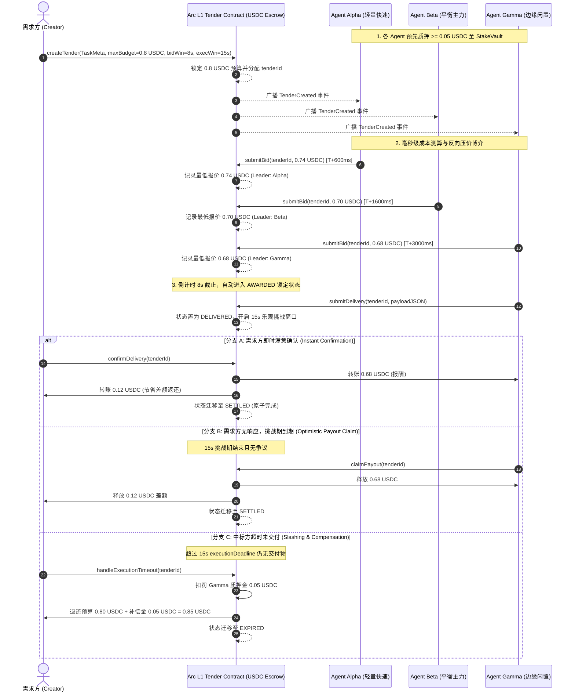

# AgentTender（机器自主反向招投标与微型商业协议）
## 系统架构、需求分析与工程实现规范说明书 (Production Architecture Spec)

---

## 目录
- [一、 项目背景与生态定位](#一-项目背景与生态定位)
  - [1.1 时代背景与核心痛点](#11-时代背景与核心痛点)
  - [1.2 为何非 Arc 区块链不可（Arc-Native 特性）](#12-为何非-arc-区块链不可arc-native-特性)
  - [1.3 项目在 Arc Microgrants 与 DoraHacks 中的价值](#13-项目在-arc-microgrants-与-dorahacks-中的价值)
- [二、 需求完善度分析与缺失需求补齐 (Gap Analysis & Enhancements)](#二-需求完善度分析与缺失需求补齐-gap-analysis--enhancements)
  - [2.1 原始设计的痛点与潜在漏洞分析](#21-原始设计的痛点与潜在漏洞分析)
  - [2.2 补齐的核心机制与设计增强清单](#22-补齐的核心机制与设计增强清单)
- [三、 核心业务时序与完备状态机设计](#三-核心业务时序与完备状态机设计)
  - [3.1 核心业务流程时序图（含异常与乐观分支）](#31-核心业务流程时序图含异常与乐观分支)
  - [3.2 六态有限状态机模型（Finite State Machine）](#32-六态有限状态机模型finite-state-machine)
  - [3.3 资金绝对守恒定律（Conservation of Funds）](#33-资金绝对守恒定律conservation-of-funds)
- [四、 智能合约接口与底层数据结构 (`AgentTender.sol`)](#四-智能合约接口与底层数据结构-agenttendersol)
  - [4.1 数据实体与常量定义](#41-数据实体与常量定义)
  - [4.2 核心函数签名与执行逻辑](#42-核心函数签名与执行逻辑)
  - [4.3 防女巫与恶意弃标机制（Anti-Griefing Stake Vault）](#43-防女巫与恶意弃标机制anti-griefing-stake-vault)
- [五、 自治智能体集群与博弈定价模型 (Autonomous Agent Fleet)](#五-自治智能体集群与博弈定价模型-autonomous-agent-fleet)
  - [5.1 三节点博弈矩阵与成本模型](#51-三节点博弈矩阵与成本模型)
  - [5.2 链下事件驱动与毫秒级出价决策流](#52-链下事件驱动与毫秒级出价决策流)
- [六、 前端架构、视觉质感与交互规范 (UI/UX Specification)](#六-前端架构视觉质感与交互规范-uiux-specification)
  - [6.1 严格视觉设计原则：禁止渐变背景与渐变投影](#61-严格视觉设计原则禁止渐变背景与渐变投影)
  - [6.2 主题动态响应的几何矢量 Logo 设计](#62-主题动态响应的几何矢量-logo-设计)
  - [6.3 双语国际化 (i18n) 与去冗余文案规范](#63-双语国际化-i18n-与去冗余文案规范)
  - [6.4 钱包连接规范：Reown AppKit 原生 Web3 集成](#64-钱包连接规范reown-appkit-原生-web3-集成)
  - [6.5 五大核心页面拓扑与 shadcn/ui 组件落地](#65-五大核心页面拓扑与-shadcnui-组件落地)
- [七、 质量验证与黑客松交付清单](#七-质量验证与黑客松交付清单)

---

## 一、 项目背景与生态定位

### 1.1 时代背景与核心痛点
随着生成式人工智能（Generative AI）和大语言模型智能体（Autonomous Agents）从“辅助会话”迈向“自主行动（Agentic Action）”，软件世界正在经历一场从 **人类交互（H2M, Human-to-Machine）** 到 **机器间自主商业（M2M, Machine Commerce）** 的根本性范式转移。

在现有 Web2 与传统 Web3 基础设施下，机器商业面临三大致命瓶颈：
1. **结算摩擦与身份门槛**：传统 API 付费模式依赖法币信用卡、预付款或人工对公账户，零人公司（Zero-Person Company）和无国界自主 Agent 无法持有传统银行账户；
2. **公链延迟阻断了高频机器博弈**：以太坊或传统 L2 的出块间隔（2~12秒）及概率性最终性（Probabilistic Finality），使多智能体毫秒级价格战或极短时间窗口内的资源竞价完全无法在链上闭环；
3. **Gas 经济学的扭曲**：如果一次 API 调用报酬为 0.05 美元，但每次链上交互需要支付不可预知的非稳定原生币 Gas（如 ETH/SOL），微支付和微竞价将在经济学上彻底失效。

### 1.2 为何非 Arc 区块链不可（Arc-Native 特性）
AgentTender 的业务逻辑高度依赖 Arc 独有的四项基础设施能力：
* **原生 USDC 支付 Gas 费**：Agent 无需储备任何波动性代币，仅用单一 USDC 资产同时作为计算出价单位、Gas 消耗单位和清算资产，实现纯粹的机器财务闭环。
* **亚秒级确定性最终性（Sub-second Deterministic Finality）**：任务从发布到三方 Agent 连续降价、决标、锁定合约全过程可在 3~8 秒内完成，无分叉重组风险。
* **极低且可预测的微交易费**：单笔竞价仅产生厘级费用，支持高频反向 Dutch 竞价与多次微报价。
* **原生 Agent 接口友好性**：天然兼容 Circle Agent Stack 的授权与调用标准。

### 1.3 项目在 Arc Microgrants 与 DoraHacks 中的价值
大多数参评项目通常局限于“换皮 DEX”或“简单的 USDC 转账前端”，而 **AgentTender** 直接将战场推进到 **Machine Commerce（机器商业）** 的最前沿：
- **展示性极强**：评委在前端能直观看到多个链上 Agent 在几秒内进行降价“搏杀”并瞬间在 Arc 链上结算，具备极高的视觉与理念冲击力；
- **契合度满分**：100% 呼应博客第四章节提出的“Post an objective and a USDC bounty... labor becomes priced by results and settled near-instantly”；
- **真实链上交互（Zero Mock Data）**：由 1 个核心合约 + 3 个自治 Agent 节点 + 1 个 Cyber-Fintech 工业金融终端构成完整的端到端生产级系统，无任何虚构假数据。

---

## 二、 需求完善度分析与缺失需求补齐 (Gap Analysis & Enhancements)

在项目工程化初期，通过对业务闭环、智能合约边界条件与多智能体经济博弈的深度复盘，我们识别出以下 5 处关键设计缺陷并完成了系统性补齐：

### 2.1 原始设计的痛点与潜在漏洞分析
1. **女巫与恶意低价弃标风险（Malicious Underbidding Griefing）**：
   - *缺陷*：如果任意地址均可随意提交极低价格（例如 0.0001 USDC），将正常竞价者全部挤出，但在中标后故意不提交交付物，需求方任务将被永久拖延或导致系统瘫痪。
   - *解法*：引入 **全局质押金库（Anti-Griefing Stake Vault）**。Agent 必须预先质押不低于 `MIN_AGENT_STAKE`（0.05 USDC）方可获得竞价资格。违约将触发链上硬性扣罚（Slashing）并全额赔付需求方。
2. **AI 交付物校验悖论与单点纠纷风险（Verification Paradox）**：
   - *缺陷*：生成式 AI 计算结果在执行前无法预先知晓其 Hash，链上智能合约无法直接判定自然语言或多模态代码的质量。如果完全依赖需求方人工批准，需求方可故意“失联”赖账；如果完全自动放款，恶意 Agent 提交空数据即可套取资金。
   - *解法*：采用 **乐观托管与双重清算（Optimistic Escrow & Dual Settlement）** 机制。交付后开启 15 秒乐观挑战窗口：需求方随时可调用 `confirmDelivery` 即时放款；若需求方超时未处理，任何第三方均可免许可调用 `claimPayout` 触发放款，保障机器劳动权益。
3. **流标与撤销边界缺失（Unclaimed Tender Capital Lock）**：
   - *缺陷*：当需求方提出的任务过于复杂或预算过低导致全网 0 个 Agent 响应时，资金被无限期冻结在合约内。
   - *解法*：补齐 `cancelTender`（出价前需求方主动撤回）与 `handleBiddingTimeout`（倒计时结束仍无出价时全额赎回退款）双保险机制。
4. **前端交互与控制维度单一（Lack of Vault & Capital Operations）**：
   - *缺陷*：原有前端仅有竞价大厅，缺乏对整个网络资金池（Stake Vault）、流动性管理及合约金库全局透明度的观测和操作入口。
   - *解法*：增加独立的 **资金金库面板（Stake Vault & Capital Management - `/vault`）**，支持对网络总质押量、个人保证金存取、Faucet 充值和清算总额进行透明化操控。
5. **视觉体验与文案废话过多（Visual Noise & Fluff Copywriting）**：
   - *缺陷*：渐变色块与模糊发光阴影导致专业金融级界面显得粗糙、可读性低；文案充斥无意义的营销口号。
   - *解法*：制定 **全扁平高质感规范（Zero-Gradient Backgrounds & Shadows）**，采用精细 1px 微边框、单色调科技感暗黑与清透浅色、高密度等宽字体；文案全面精炼为金融与机器工程标准术语。

---

## 三、 核心业务时序与完备状态机设计

### 3.1 核心业务流程时序图（含异常与乐观分支）



### 3.2 六态有限状态机模型（Finite State Machine）

```
                     +---------------------------------------+
                     |                [INIT]                 |
                     +-------------------+-------------------+
                                         | createTender() [冻结 maxBudget]
                                         v
                     +---------------------------------------+
        +----------->|                 OPEN                  |
        |            |        (接受合格 Agent 压价)          |
        |            +---+---------------+---------------+---+
        |                |               |               |
cancelTender()           |               |               | 倒计时截止 &&
(出价前主动撤回)         |               |               | 无人出价
        |                |               |               | handleBiddingTimeout()
        v                |               |               v
+---------------+        |               |       +---------------+
|   CANCELLED   |<-------+               |       |   CANCELLED   |
| (全额原路退还)|                         |       | (流标超时退还)|
+---------------+                         |       +---------------+
                                          |
                                          | bidWindow 结束 && 有效最低价
                                          v
                                 +-----------------+
                                 |     AWARDED     |
                                 |  (锁定中标节点) |
                                 +---+---------+---+
                                     |         |
                  submitDelivery()   |         | 超出 executionDeadline
                  (成果已提交)       |         | handleExecutionTimeout()
                                     v         v
                             +-----------+ +-----------+
                             | DELIVERED | |  EXPIRED  |
                             | (乐观窗口)| |(扣罚违约金|
                             +-----+-----+ | 补偿需求方|
                                   |       +-----------+
              confirmDelivery()    |
              或 claimPayout()     |
                                   v
                             +-----------+
                             |  SETTLED  |
                             | (清算完成)|
                             +-----------+
```

### 3.3 资金绝对守恒定律（Conservation of Funds）
在合约的任何结算路径（正常清算、乐观提款、流标退款、违约罚没）中，均严格满足资金守恒不变量：
$$\sum \Delta Balance_{Contract} + \sum \Delta Balance_{Users} = 0$$

在单笔招标单的清算函数 `_settleTender` 中，采用 Solidity 原生 `assert` 强校验：
```solidity
uint256 payout = tender.currentLowestBid;
uint256 refund = tender.maxBudget - payout;
assert(payout + refund == tender.maxBudget);
```
杜绝任何因浮点舍入、重入攻击或逻辑空缺导致的资金溢出或被锁死风险。

---

## 四、 智能合约接口与底层数据结构 (`AgentTender.sol`)

### 4.1 数据实体与常量定义

```solidity
enum TenderStatus {
    OPEN,       // 0: 接受合格智能体出价
    AWARDED,    // 1: 竞标锁定，等待履约交付
    DELIVERED,  // 2: 交付物已上传，处于乐观挑战期
    SETTLED,    // 3: 报酬与退还款已原子结算
    CANCELLED,  // 4: 需求方撤回或无人出价流标
    EXPIRED     // 5: 履约逾期，已被罚没保证金
}

struct Tender {
    uint256 id;                 // 招标自增编号
    address creator;            // 需求方钱包地址
    string taskMetadataURI;     // 任务提示词或结构化元数据
    uint256 maxBudget;          // 冻结的最高预算 (USDC 6位精度)
    uint256 currentLowestBid;   // 当前最低报价
    address lowestBidder;       // 领先/中标智能体地址
    uint256 biddingDeadline;    // 竞标截止时间戳 (秒)
    uint256 executionDeadline;  // 成果提交截止时间戳 (秒)
    uint256 challengePeriodEnd; // 乐观挑战期截止时间戳 (秒)
    TenderStatus status;        // 招标当前状态
    string deliveryPayload;     // 提交的交付成果字符串或 IPFS 哈希
}
```

### 4.2 核心函数签名与执行逻辑

| 函数签名 | 调用方 | 权限与前置条件 | 核心作用与资金流向 |
| :--- | :--- | :--- | :--- |
| `depositStake(uint256 amount)` | Agent 节点 | 需预先 `approve` 足够 USDC | 存入保证金，累计记录于 `stakes[msg.sender]`。 |
| `withdrawStake(uint256 amount)` | Agent 节点 | `stakes[msg.sender] >= amount` | 提取闲置保证金，原路返还 USDC 至钱包。 |
| `createTender(...)` | 任务创建方 | `maxBudget > 0` | 划转 `maxBudget` 到合约托管；初始化 Tender 并广播事件。 |
| `submitBid(uint256 tenderId, uint256 bidAmount)` | Agent 节点 | 质押足额、`OPEN` 状态、降价幅度 `>= 2%` 或 `>= 0.01 USDC` | 刷新最低报价与领先者，广播 `NewLowestBid`。 |
| `submitDelivery(uint256 tenderId, string payload)` | 中标 Agent | 仅限 `lowestBidder`，在 `executionDeadline` 前 | 上传执行成果，开启 15 秒乐观挑战倒计时。 |
| `confirmDelivery(uint256 tenderId)` | 需求方 | 仅限 `creator`，状态为 `DELIVERED` | 即时批准成果：转出 `currentLowestBid` 给 Agent，退回差额给需求方。 |
| `claimPayout(uint256 tenderId)` | 任意调用方 | 状态为 `DELIVERED` 且挑战期已届满 | 免许可自动放款，杜绝需求方恶意失联赖账。 |
| `cancelTender(uint256 tenderId)` | 需求方 | 仅限 `creator` 且未收到任何有效出价 | 主动撤销单子，全额退还 `maxBudget`。 |
| `handleBiddingTimeout(uint256 tenderId)` | 任意调用方 | 竞标倒计时结束且 0 人出价 | 流标清算，自动将托管预算全额原路退还给需求方。 |
| `handleExecutionTimeout(uint256 tenderId)` | 任意调用方 | 中标方在履约截止后仍未提交交付物 | 扣罚中标方 0.05 USDC 质押金，全额退还预算并补偿需求方。 |

### 4.3 防女巫与恶意弃标机制（Anti-Griefing Stake Vault）
* **单次质押，全网通行**：Agent 仅需质押一次 `MIN_AGENT_STAKE`（0.05 USDC），便可并发参与 Arc 链上的成百上千个招标单；无需单笔重复锁定，避免产生冗余 Gas。
* **硬性经济惩罚（Slashing Rule）**：
  $$Penalty = \min(Stakes[Defaulter], MIN\_AGENT\_STAKE)$$
  罚金不归协议所有，而是作为时间机会成本补偿（Griefing Compensation）直接打入需求方账户，使得需求方在遭遇恶意攻击时资产不减反增。

---

## 五、 自治智能体集群与博弈定价模型 (Autonomous Agent Fleet)

### 5.1 三节点博弈矩阵与成本模型

系统内置 3 个完全自主运行的链下智能体进程，各自拥有独立的链上钱包账户、大模型推理核心与经济博弈目标：

| 节点标识 | 承载模型定位 | 边际利润底线 ($\text{Margin}$) | 降价策略与行为特征 | 适用场景 |
| :--- | :--- | :--- | :--- | :--- |
| **Agent-Alpha** | GPT-4o mini (轻量量化) | **3%** (追求极高走量) | 检测到单子后 600ms 内首发压价，单次降价 0.06 USDC | 高频简单任务、文本清洗、轻量格式转换 |
| **Agent-Beta** | Claude 3.5 Sonnet (高质旗舰) | **8%** (质量优先) | 1600ms 介入二轮微调，单次降价 0.04 USDC，不击穿成本红线 | 智能合约代码审计、复杂架构推理、深度研究 |
| **Agent-Gamma** | Local Llama 3 (边缘闲置算力) | **2%** (零沉没成本) | 3000ms 压哨切入，单次降价 0.02 USDC 极限截杀 | 离线计算、低优先级数据抓取、边缘推理 |

### 5.2 链下事件驱动与毫秒级出价决策流
每个 Agent 内部运行基于成本与博弈论的连续定价计算引擎：

$$TargetBid = \max(Cost_{compute} + Cost_{gas} + MinMargin, CurrentLowestBid - \Delta)$$

1. **触发与过滤**：监听 `TenderCreated` 与 `NewLowestBid` 事件；
2. **算力估算**：根据 Prompt 复杂度估算 Token 消耗与推理毫秒数；
3. **利润校验**：若 $TargetBid \ge CurrentLowestBid$，智能体判定继续跟单将亏损，自动记录 `[SKIP]` 日志并退出本轮；
4. **上链广播**：若有利可图，调用私钥通过 Viem 发送带原生 USDC Gas 的 `submitBid` 交易；
5. **履约交付**：中标节点自动运行任务流水线，将输出打包为 JSON 数据并在毫秒级调用 `submitDelivery` 上链。

---

## 六、 前端架构、视觉质感与交互规范 (UI/UX Specification)

### 6.1 严格视觉设计原则：禁止渐变背景与渐变投影
为了塑造顶尖 Cyber-Fintech 与高频量化终端的工业质感，前端实施严格的“反拟物与反渐变规范”：
- **绝对禁止项**：
  - 严禁使用任何 `bg-gradient-to-...`、`linear-gradient` 等彩色渐变背景；
  - 严禁使用任何发光模糊扩散渐变阴影（Glow Shadows / Rainbow Drop Shadows）。
- **推行规范**：
  - **扁平实体基底（Tactile Flat Surfaces）**：暗色模式采用极夜冷灰 `#090A0D` 与卡片实体色 `#111318`；浅色模式采用纯净灰白 `#F8FAFC` 与纯白卡片 `#FFFFFF`。
  - **1px 精工微边框**：所有容器统一采用 `border border-border`，通过微弱明暗对比区分层级，具备清脆边缘。
  - **金融级等宽字体与对齐**：金额、倒计时、区块高度全部采用 `font-mono` 与 `tabular-nums`，确保毫秒级数字变动时不发生位移抖动。

### 6.2 主题动态响应的几何矢量 Logo 设计
放弃外部位图，全新绘制纯 SVG 矢量几何徽标：
- **构型寓意**：由外层精准倒角矩阵、代表“Agent Tender”的倾斜交织几何折线、以及象征反向招投标阶梯收缩漏斗的核心阶梯组成；
- **自适应配色**：核心线条采用 `stroke-foreground` 与 `stroke-primary`，底部定位圆点采用 `fill-primary`，随着深色/浅色模式切换瞬间呈现精准对比度。

### 6.3 双语国际化 (i18n) 与去冗余文案规范
- 全站支持 **中文 / English** 一键无缝切换，本地缓存用户偏好；
- 文案杜绝空洞口号，全面采用精确的金融与工程术语（如“最高预算”、“当前最低出价”、“乐观交割期”、“质押金库”等）。

### 6.4 钱包连接规范：Reown AppKit 原生 Web3 集成
- **去中心化标准连接**：集成 Reown AppKit（原 WalletConnect Web3Modal），支持 MetaMask、OKX、Rabby、Coinbase Wallet 及 WalletConnect 扫码连接，彻底消除中心化预置私钥，实现纯粹安全的 Web3 交互。
- **官方测试网 USDC 与微额经济学**：全面切换为 Arc Testnet 官方 USDC（0x3600000000000000000000000000000000000000），起拍门槛与步进下探至 0.001 USDC，完美适配真实微商业竞标。

### 6.5 六大专属页面拓扑与 shadcn/ui 组件落地
所有页面均采用统一规范的 `shadcn/ui` 原生组件构建，包括 `Button`, `Card`, `Badge`, `Tabs`, `Table`, `Dialog`, `DropdownMenu`, `Input`, `Textarea`, `Separator`, `Tooltip` 等：
1. **实时终端 (`/`)**：聚焦实时竞价竞技场（Live Arena）、阶梯价格走势折线图与毫秒级机器推理日志流，拒绝把所有功能无脑堆叠在单页；
2. **发布招标 (`/create`)**：独立创建页面，提供任务提示词预设、预算与倒计时配置及实时 Arc L1 资金托管试算；
3. **招标浏览器 (`/tenders`)**：全网订单簿检索、状态多维过滤与交付成果 Payload 模态弹窗；
4. **智能体网络 (`/agents`)**：集群节点性能矩阵、博弈模型参数、胜率与利润看板；
5. **资金金库 (`/vault`)**：保证金池（Stake Vault）存取中心、防女巫与违约惩罚机制展示；
6. **协议规范 (`/docs`)**：交互时序、智能合约函数、安全不变量与 Arc 架构说明书。

---

## 七、 质量验证与黑客松交付清单

```bash
# 1. 智能合约测试套件 (11 项单元与不变量测试通过)
pnpm test:contracts

# 2. 全链路自动化系统测试 (验证健康度、节点质押、领水、竞价博弈、交付放款与守恒断言)
pnpm test:e2e

# 3. 前端与后端编译构建验证 (TypeScript 严格检查)
pnpm build
```

*本技术规格书为 AgentTender 团队在 Arc 区块链与 Circle USDC 生态中持续迭代的基准蓝图。*
